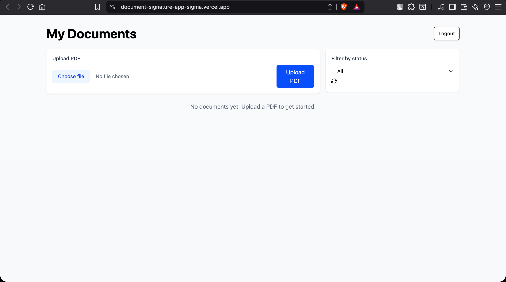
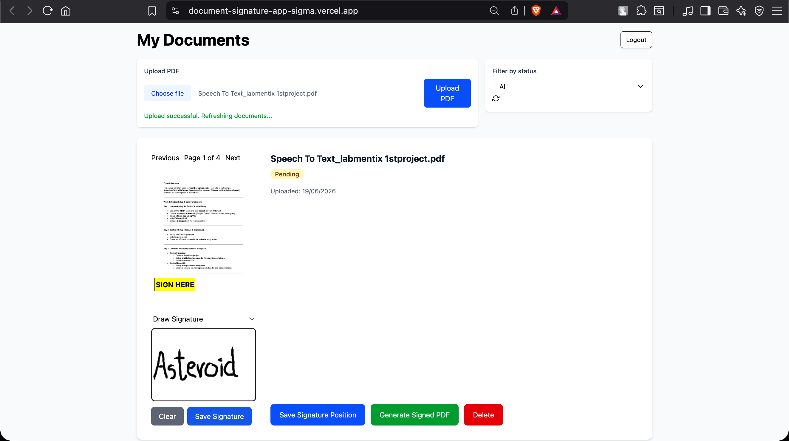
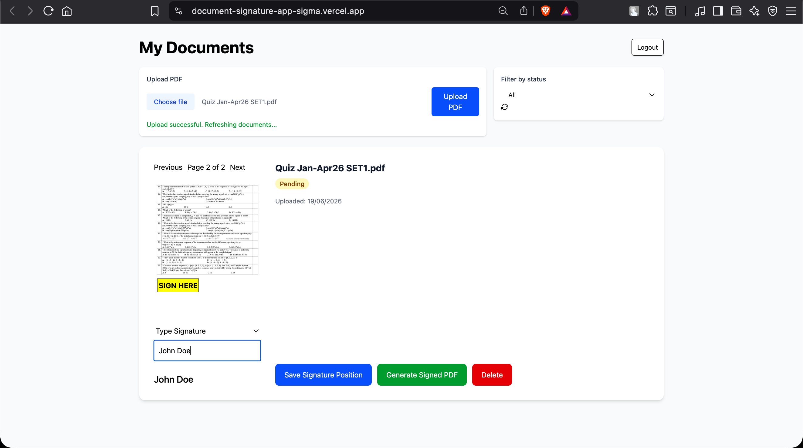
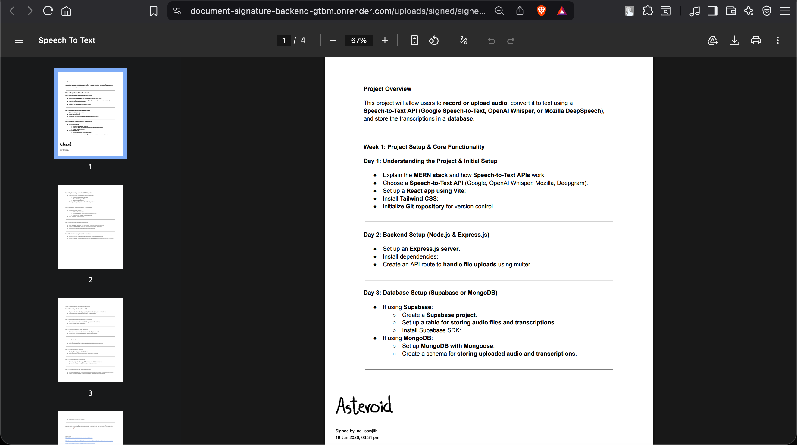

# 📄 Document Signature Application

A full-stack MERN application that allows users to upload PDF documents, place digital signatures, and generate signed PDF files with signer information and timestamps.

## 🚀 Live Demo

Frontend: https://document-signature-app-sigma.vercel.app

## 📌 Project Overview

The Document Signature Application streamlines the document signing process by enabling users to:

- Upload PDF documents
- Preview documents directly in the browser
- Draw handwritten signatures
- Type digital signatures
- Place signatures at desired locations
- Generate signed PDF documents
- Store signature information in MongoDB
- Track signer details and signing timestamps

This project was developed as part of a software development internship project.

---

## ✨ Features

### Authentication
- User Registration
- User Login
- JWT-based Authentication
- Protected Routes

### Document Management
- Upload PDF documents
- View uploaded documents
- Delete documents
- Dashboard for document tracking

### Signature Management
- Draw signatures using a signature pad
- Type signatures
- Drag-and-drop signature placement
- Save signature positions
- Store signature metadata in MongoDB

### PDF Processing
- Generate signed PDF documents
- Embed drawn signatures into PDFs
- Embed typed signatures into PDFs
- Display signer information
- Display signing timestamp

### Audit Logging
- Record signing actions
- Track document activity
- Maintain signing history

---

## 🛠️ Tech Stack

### Frontend
- React.js
- Vite
- Tailwind CSS
- Axios
- React PDF

### Backend
- Node.js
- Express.js
- JWT Authentication

### Database
- MongoDB Atlas
- Mongoose

### PDF & Signature Tools
- pdf-lib
- react-signature-canvas

### Deployment
- Vercel (Frontend)
- Render (Backend)

---

## 📂 Project Structure

```
document-signature-app/
│
├── frontend/
│   ├── src/
│   ├── public/
│   └── package.json
│
├── backend/
│   ├── src/
│   │   ├── controllers/
│   │   ├── routes/
│   │   ├── models/
│   │   ├── middleware/
│   │   └── utils/
│   │
│   └── package.json
│
└── README.md
```

---

## 📸 Screenshots

### Dashboard



### Draw Signature



### Typed Signature



### Generated Signed PDF



---

## ⚙️ Installation

### Clone Repository

```bash
git clone https://github.com/sowjithchinnu/document-signature-app.git
cd document-signature-app
```

### Backend Setup

```bash
cd backend

npm install

npm start
```

Backend runs on:

```bash
http://localhost:3001
```

### Frontend Setup

```bash
cd frontend

npm install

npm run dev
```

Frontend runs on:

```bash
http://localhost:5173
```

---

## 🔐 Environment Variables

### Backend (.env)

```env
PORT=3001

MONGO_URI=your_mongodb_connection_string

JWT_SECRET=your_jwt_secret
```

### Frontend (.env)

```env
VITE_API_URL=http://localhost:3001
```

---

## 🧪 Testing Performed

- User Registration
- User Login
- PDF Upload
- PDF Preview
- Draw Signature
- Typed Signature
- Signature Position Saving
- Signed PDF Generation
- Signature Metadata Storage
- Audit Log Creation
- MongoDB Integration

---

## 🎯 Key Learning Outcomes

Through this project, I gained experience with:

- Full-Stack MERN Development
- JWT Authentication
- MongoDB Database Design
- REST API Development
- PDF Manipulation using pdf-lib
- React State Management
- File Upload Handling
- Deployment using Vercel and Render
- Git & GitHub Workflow

---

## 👨‍💻 Author

**Nalli Sowjith Kumar**

ECE Student, IIIT Dharwad

GitHub: https://github.com/sowjithchinnu

Portfolio: https://sowjith.dev

---

## 📜 License

This project was developed for educational and internship purposes.